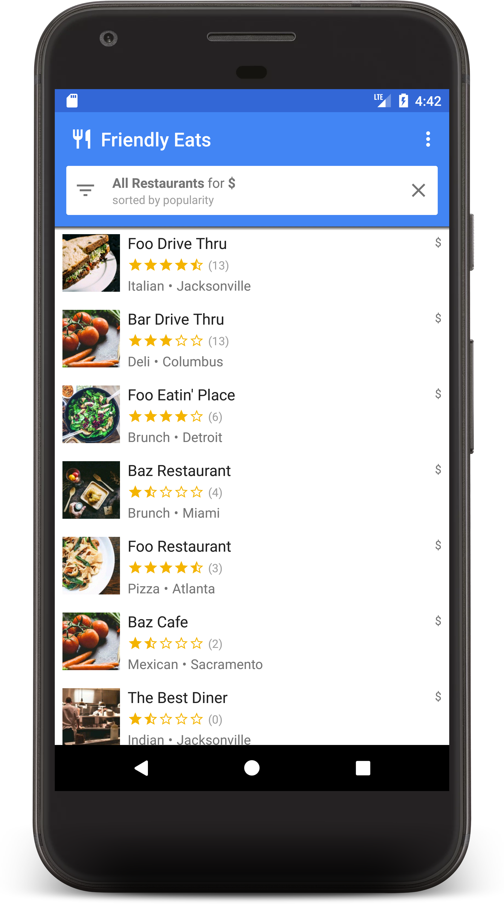

# Friendly Eats

This is the source code that accompanies the Firestore Android Codelab:
https://codelabs.developers.google.com/codelabs/firestore-android

The codelab will walk you through developing an Android restaurant recommendation
app powered by Cloud Firestore.

If you don't want to do the codelab and would rather view the completed
sample code, see the Firebase Android Quickstart repository:
https://github.com/firebase/quickstart-android

## This repo's Build Status

[![Actions Status][gh-actions-badge]][gh-actions]

[gh-actions]: https://github.com/Dood345/CPRE-388/lab5/actions](https://github.com/Dood345/CPRE-388/actions?query=branch%3Alab5
[gh-actions-badge]: https://github.com/Dood345/CPRE-388/workflows/Android%20CI/badge.svg
